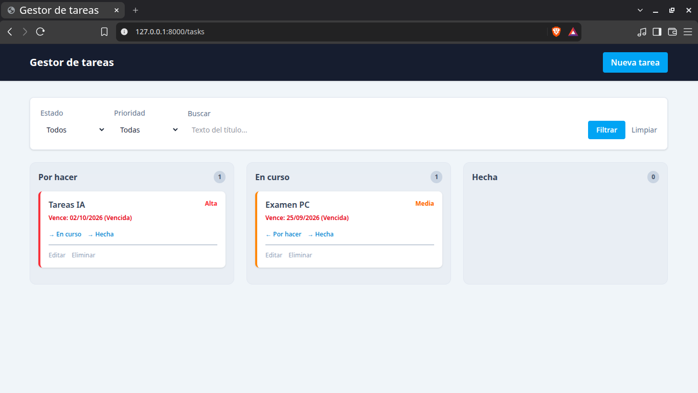
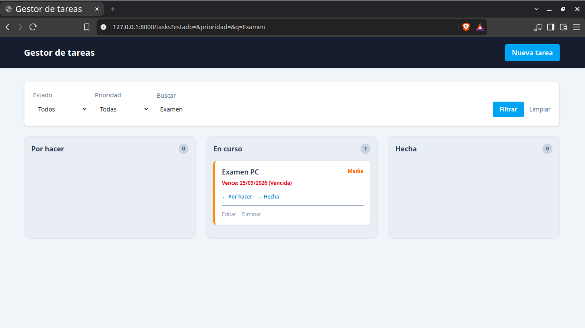
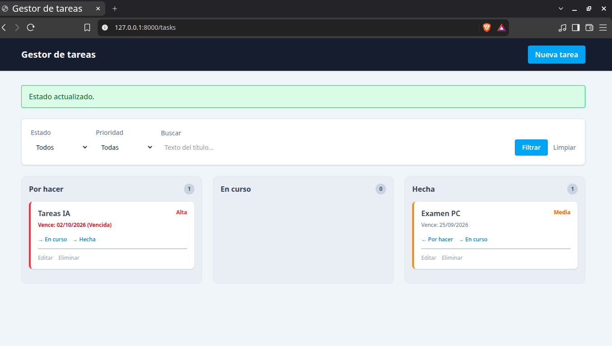
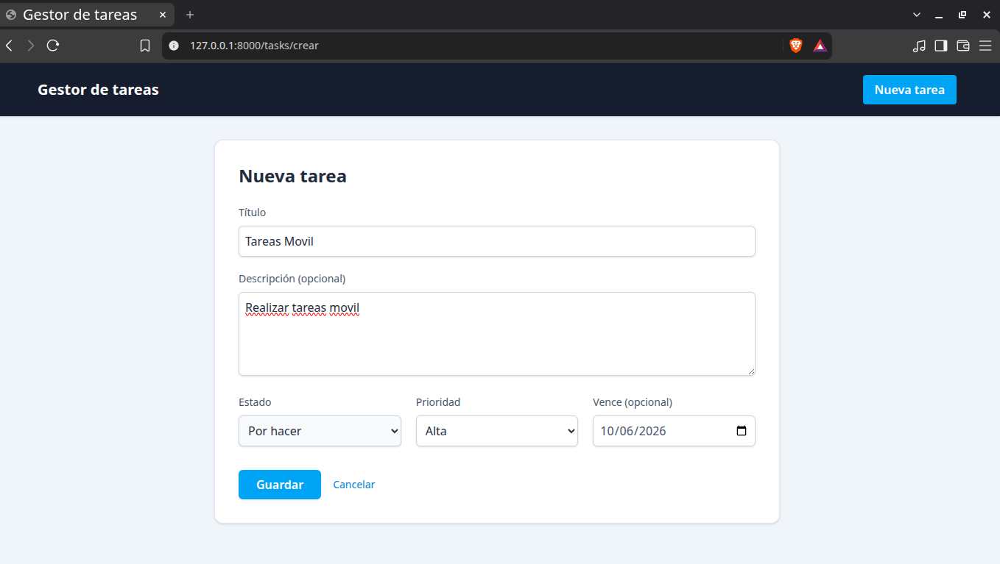
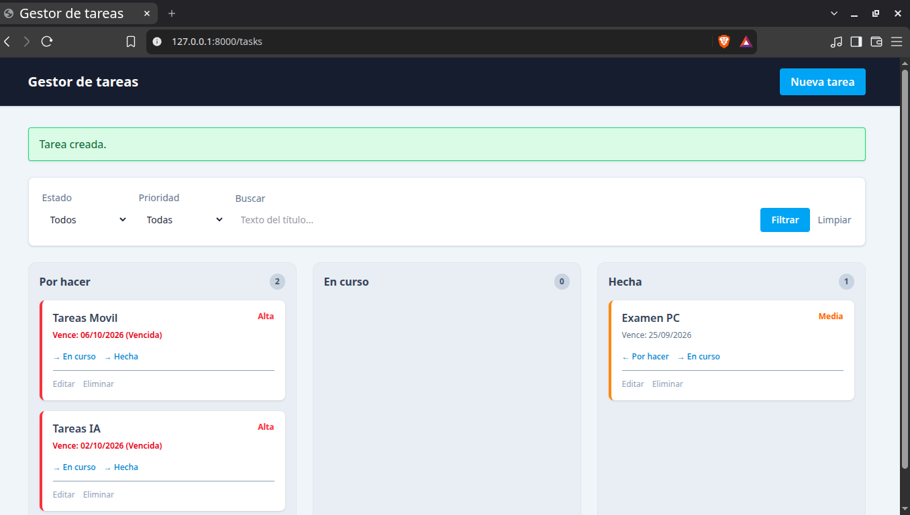

# Gestor de tareas

## CRUD - gestor de actividades

Crear proyecto Laravel

```bash
# Levantar servidor XAMPP y bd
$ sudo /opt/lampp/lampp start
$ sudo /opt/lampp/lampp status

# Crear proyecto
$ composer create-project laravel/laravel:^12.0 primer-proyecto
$ cd primer-proyecto
$ npm install

# Levantar el proyecto (backend)
$ php artisan serve 

# Levantar el proyecto (frontend)
$ npm run dev

# Generar la migracion y modelo
$ php artisan make:model Task -m

# Generar controlador
$ php artisan make:controller TaskController

# Ejecutar las migraciones
$ php artisan migrate

# Ver lista de rutas
php artisan route:list
```





