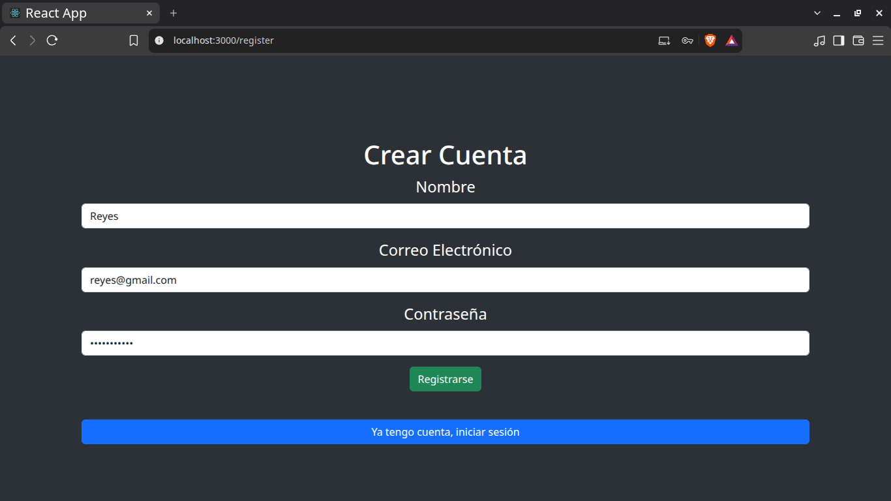
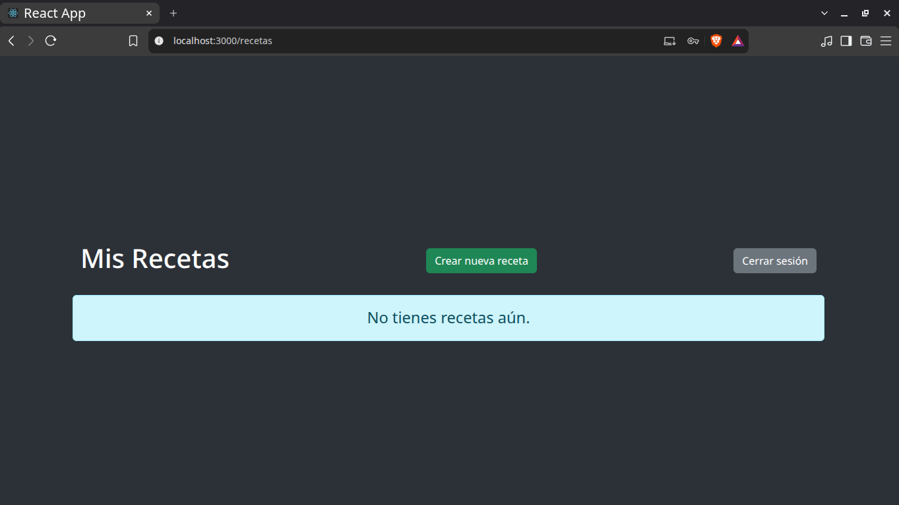
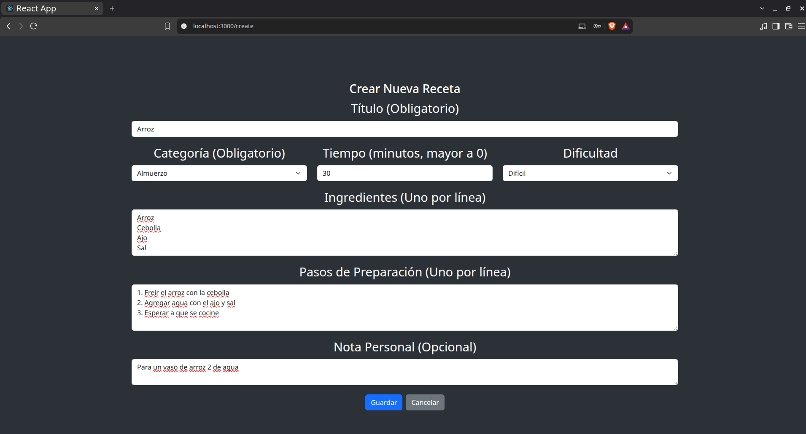
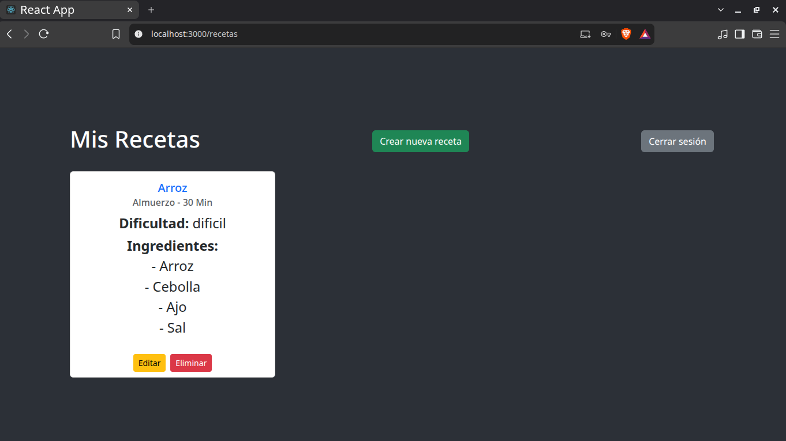
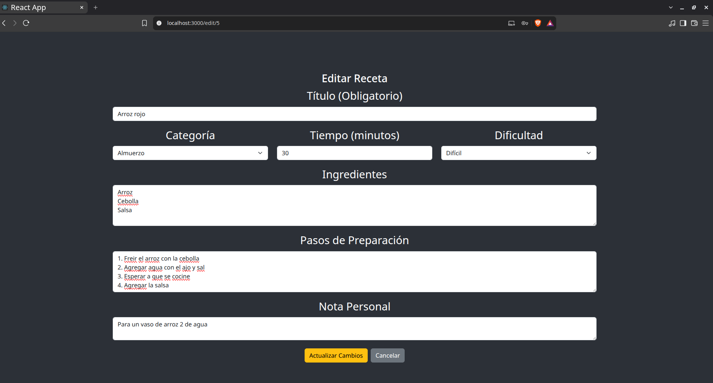
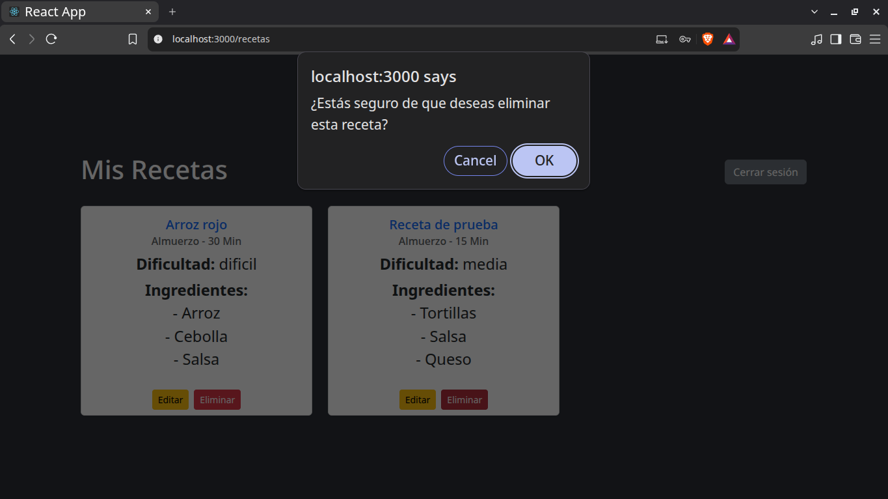
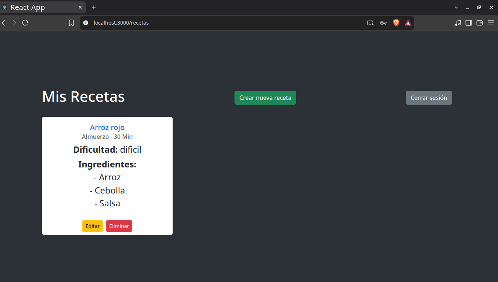
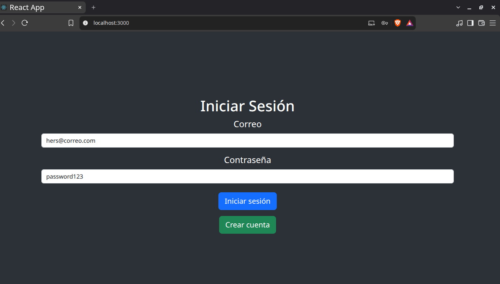

# Recetario casero
Desarrollado en Laravel + REACT con XAMPP y Composer

## Crear proyecto Laravel

```bash
$ sudo /opt/lampp/lampp start
$ composer create-project laravel/laravel:^12.0 recetario-casero
$ cd recetario-casero
$ npm install
$ php artisan install:api

$ php artisan make:model Receta -m
$ php artisan make:controller RecetaController
$ php artisan make:controller AuthController

```

Verifcamos la conexión a MySQL

```bash
DB_CONNECTION=mysql
DB_HOST=127.0.0.1
DB_PORT=3306
DB_DATABASE=recetario_casero
DB_USERNAME=root
DB_PASSWORD=
```

## Crear proyecto REACT

```bash
# Instalar react
$ npx create-react-app reactfrontend
$ cd reactfrontend
$ npm i axios bootstrap react-router-dom@6

# Levantar proyecto
$ npm start
```

## Registrarse con un usuario nuevo



## Crear un receta



## Editar receta



## Eliminr una receta



## Iniciar sesión con otra cuenta

