# Sistema de Torneos con Roles
Desarrollado en Laravel + REACT con XAMPP y Composer

## Crear proyecto Laravel

```bash
# Levantar servidor XAMPP y bd
$ sudo /opt/lampp/lampp start

# Crear proyecto
$ composer create-project laravel/laravel:^12.0 sistema-torneos
$ cd sistema-torneos
$ npm install

# Instalar API y Sanctum 
$ php artisan install:api

# Crear migraciones y modelos
$ php artisan make:model Torneo -m
$ php artisan make:model Inscripcion -m

# Crear controladores
$ php artisan make:controller AuthController
$ php artisan make:controller TorneoController
$ php artisan make:controller InscripcionController

# Crear middleware
php artisan make:middleware CheckRole
```

El administrador se creo mediente un seeder en sistema-torneos/database/seeders/DatabaseSeeder.php
```php
 User::create([
            'name' => 'Administrador',
            'email' => 'admin@torneos.com',
            'password' => Hash::make('admin123'),
            'role' => 'admin',
        ]);
Levantamos el proyecto con las migraciones y seeders
```

```bash
# Ejecutar las migraciones
$ php artisan migrate --seed

# Levantar el proyecto (backend)
$ php artisan serve 
```

## Crear proyecto React

```bash
# Instalar react
$ npx create-react-app reactfrontend
$ cd reactfrontend
$ npm i axios bootstrap react-router-dom@6

# Levantar proyecto
$ npm start
```

## Pantalla de inicio
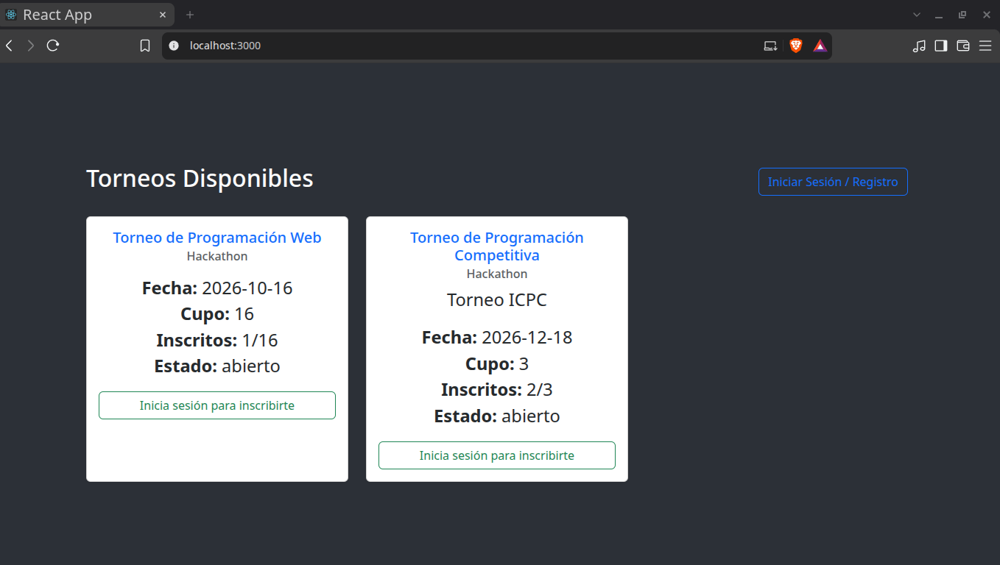

## Iniciar sesión como Admin


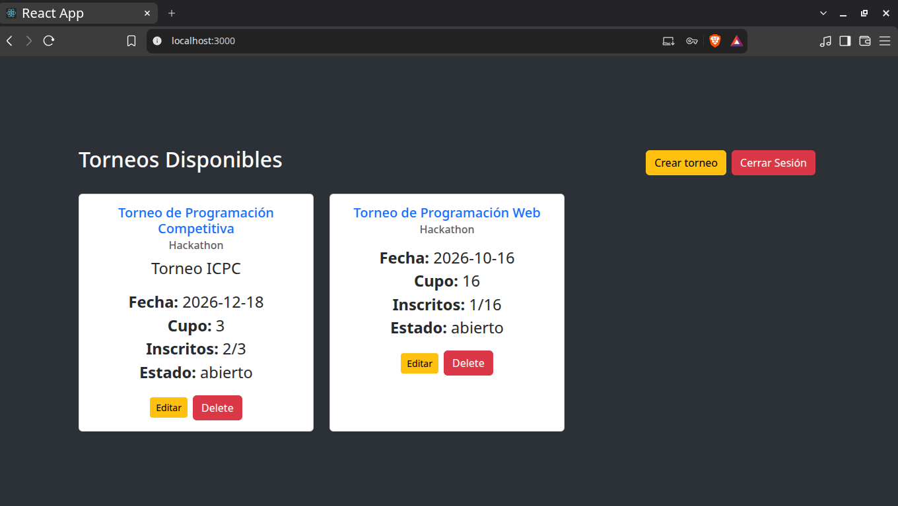

## Crear un torneo Admin
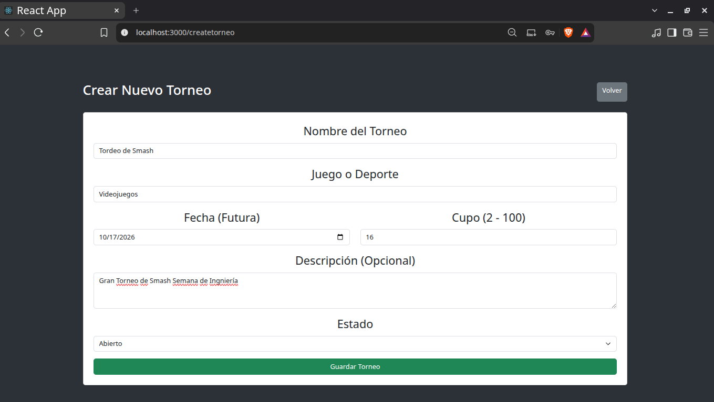

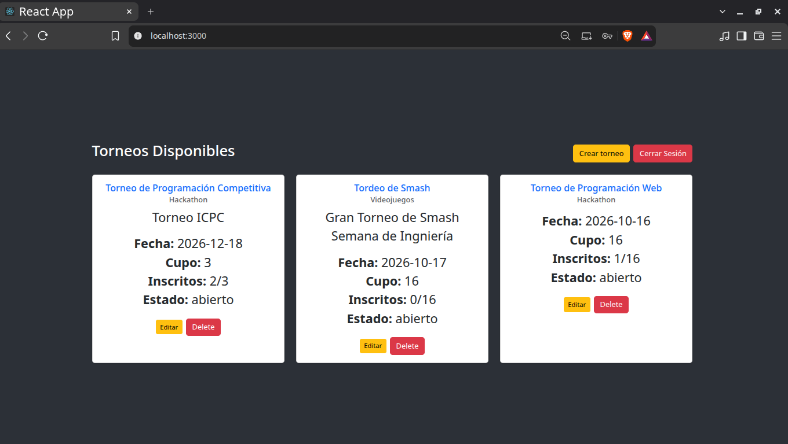

## Editar un torneo Admin
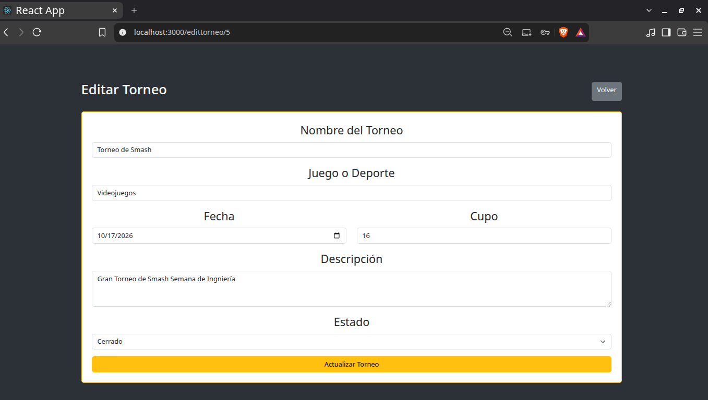

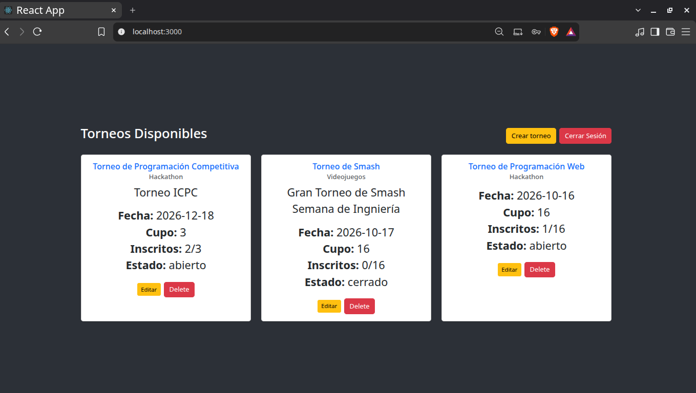

## Eliminar un torneo admin
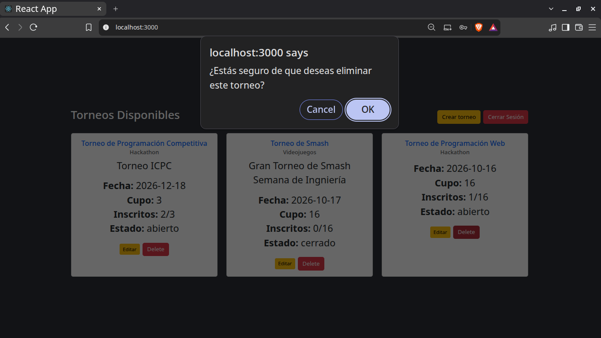

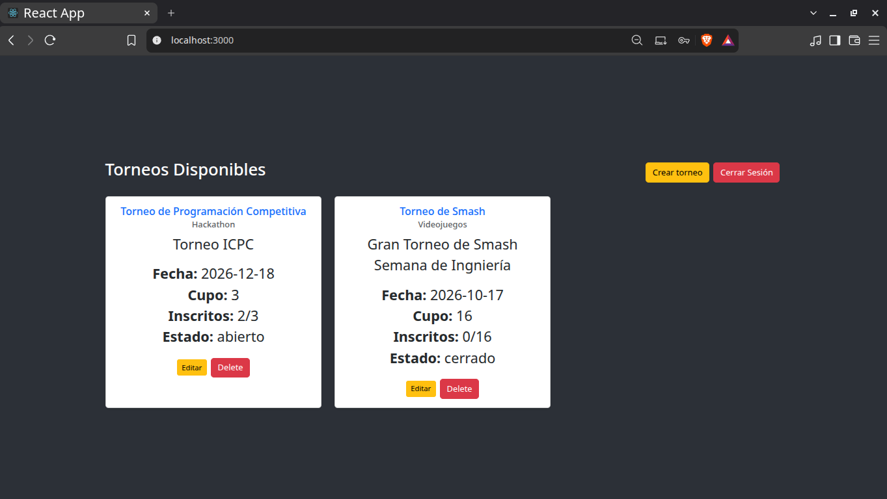

## Crear un cuenta
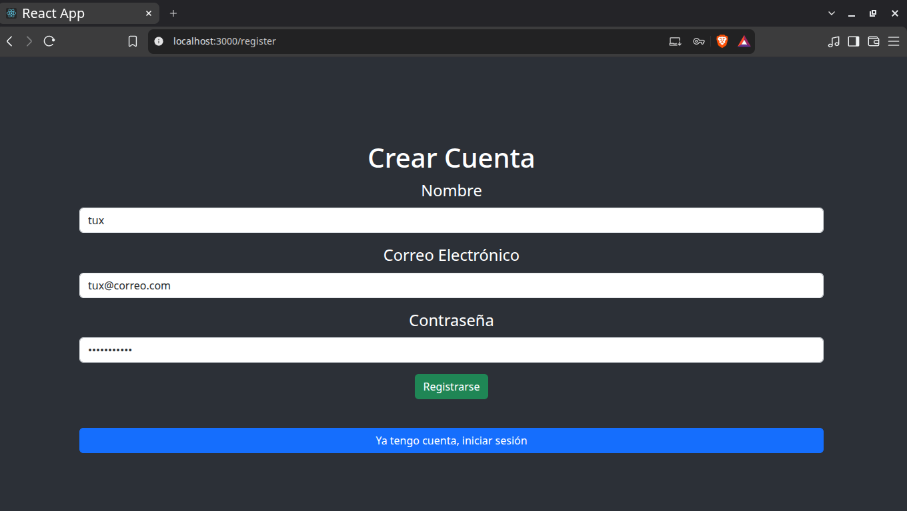

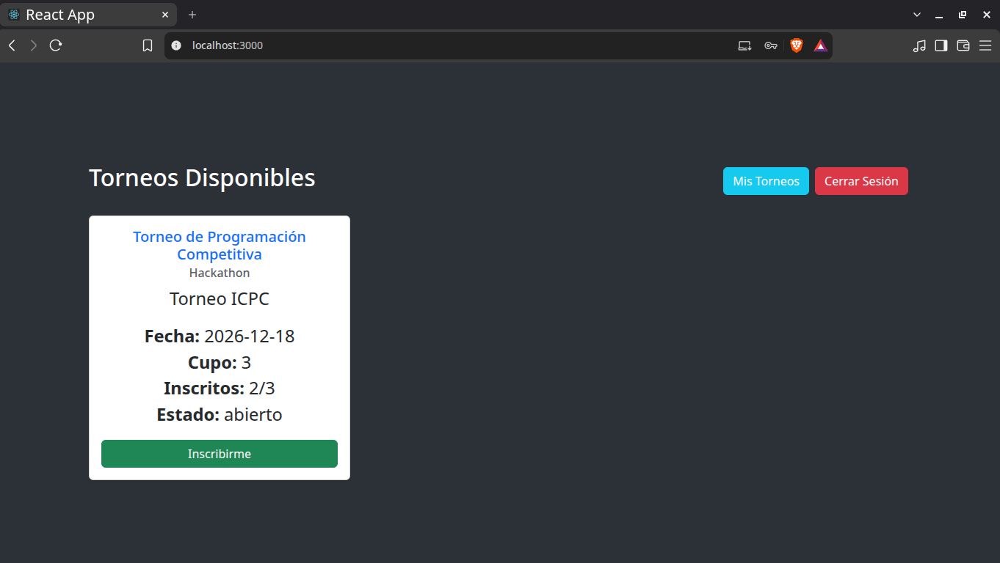

## Inscribirme a un torneo
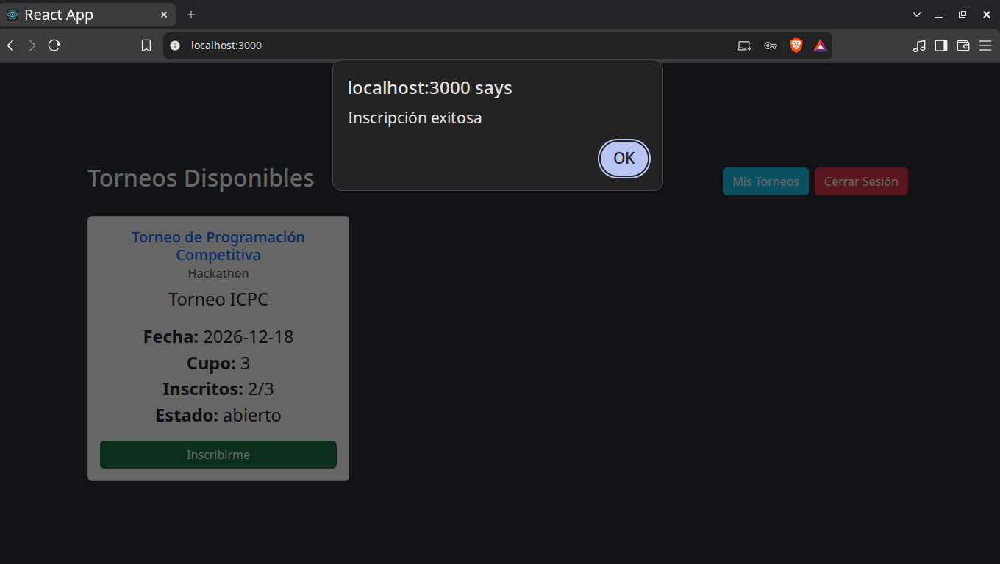

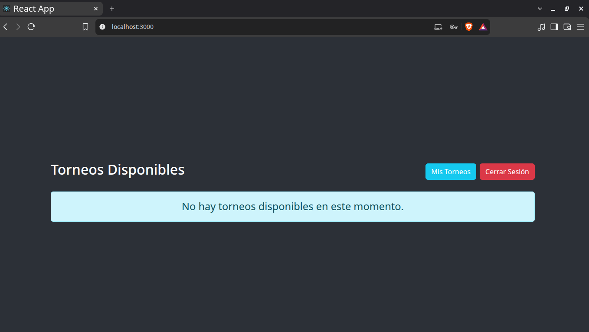

## Cancelar suscripcion de un toreno
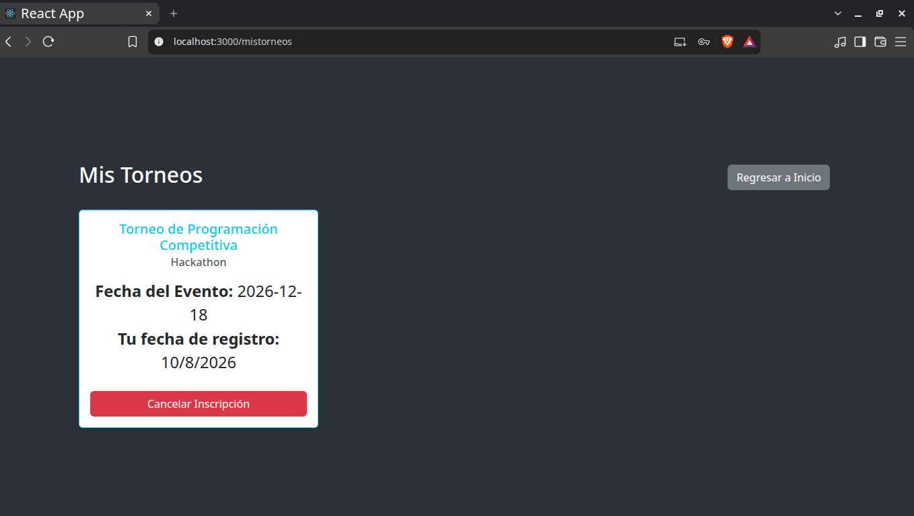

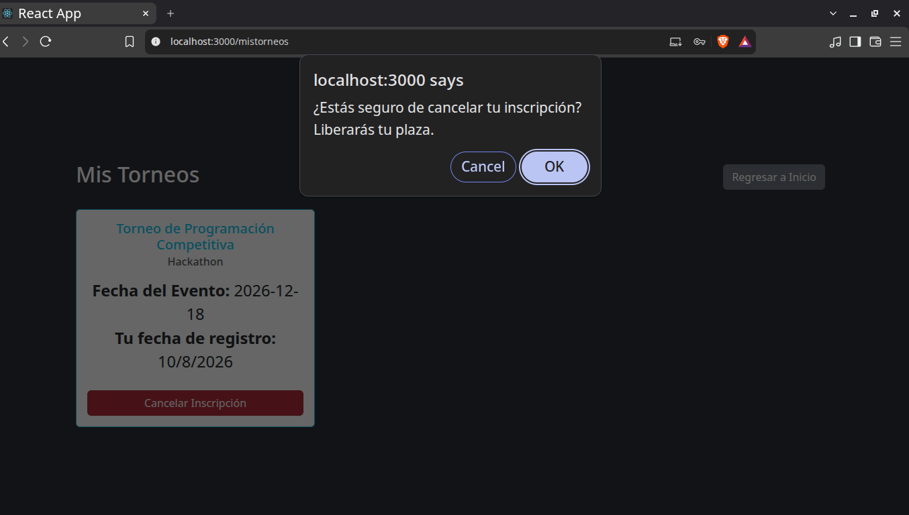

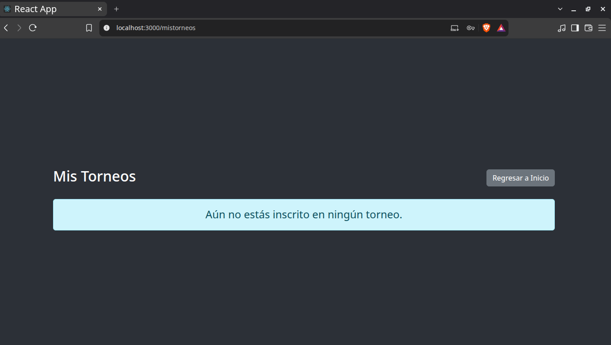

## Iniciar sesión con otra cuenta
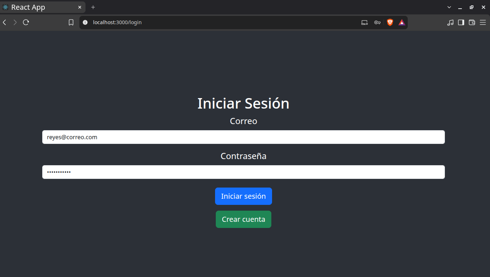

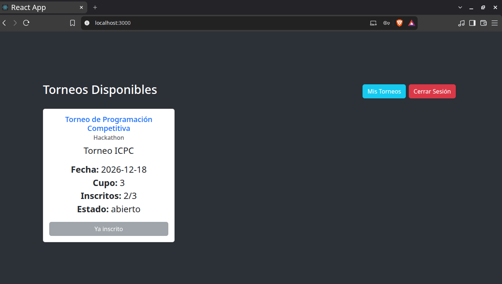

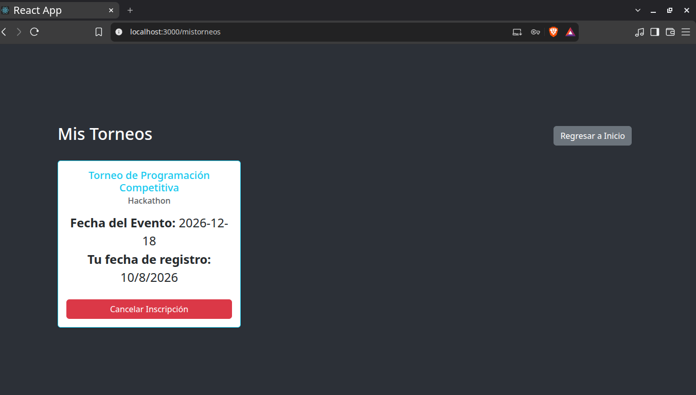